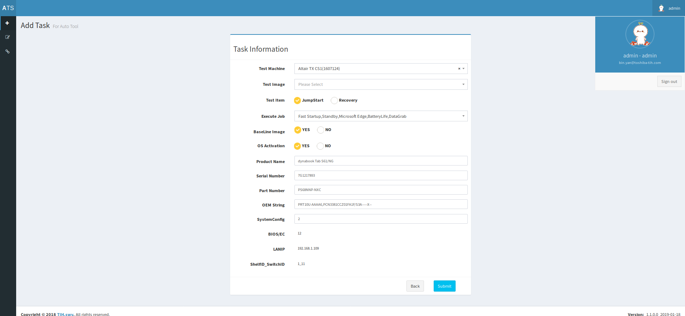
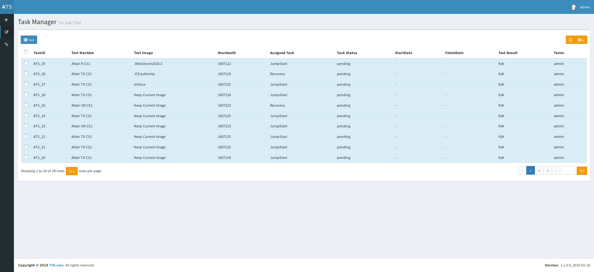
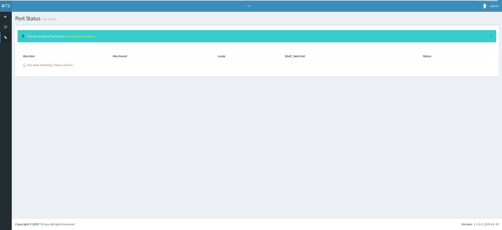

## ats_sizu work project 
 `use AdminLTE plugins update for respository ATS`
 
 ### 界面效果图
 
 
 
 
 
 
 
 
 
### 开发环境
* 原生php5.6
* AdminLTE(bootstrap3)
* Jquery

 `(仓库不再更新, 移到https://github.com/ss7424Refar/ats_kimi.git)`